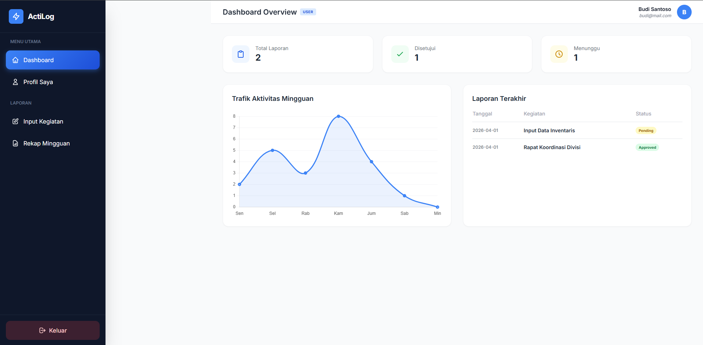
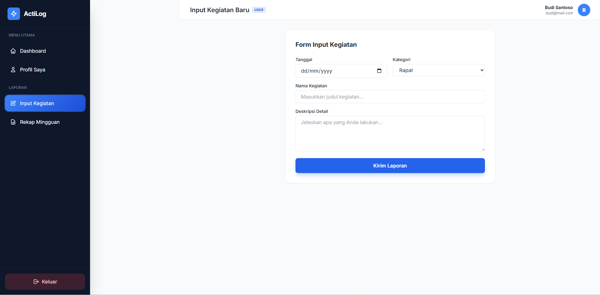
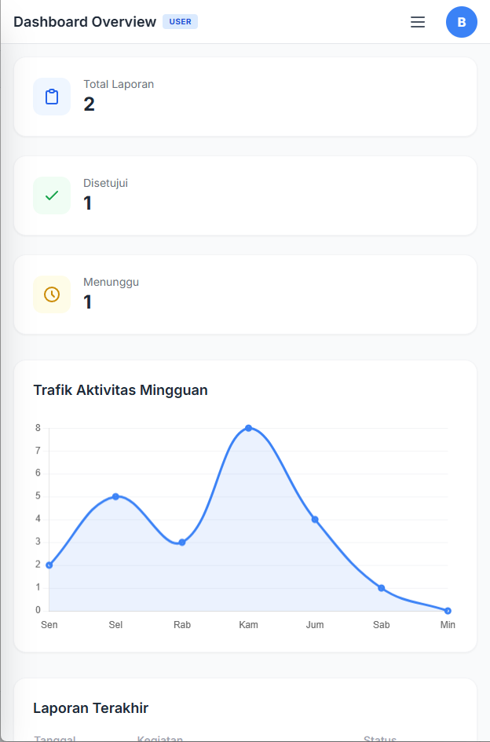
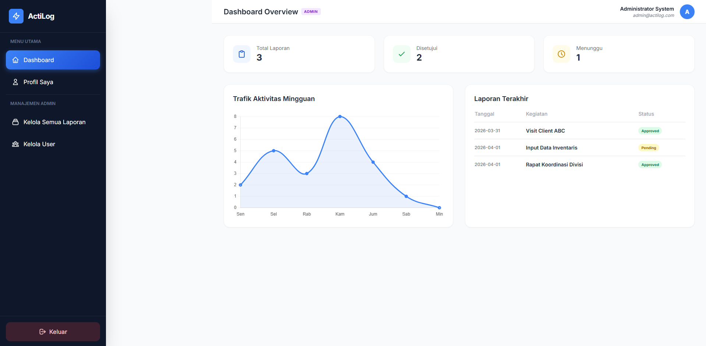

# ActiLog - Sistem Laporan Kegiatan Harian

## 📋 Overview

**ActiLog** adalah aplikasi web lengkap untuk **manajemen laporan kegiatan harian** karyawan. Dibangun dengan desain modern, responsive, dan siap produksi.

**Fitur Utama:**

- ✅ **Login Sistem** dengan role User/Admin
- ✅ **Dashboard Interaktif** dengan statistik & grafik Chart.js
- ✅ **Input Laporan** mudah dengan form validasi
- ✅ **Rekap Mingguan** dengan filter & export Excel
- ✅ **Manajemen Admin** (approve/hapus laporan, kelola user)
- ✅ **Fully Responsive** (mobile, tablet, desktop)
- ✅ **Animasi Halus** & notifikasi toast
- ✅ **Demo Data** siap test

## 🚀 Demo Credentials

| Role      | Username | Password | Akses Menu |
| --------- | -------- | -------- | ---------- |
| **Admin** | `admin`  | `admin`  | Semua      |
| **User**  | `user1`  | `user1`  | User only  |

## 🎯 Quick Start (XAMPP)


**Satu File Saja!** Semua fitur dalam `index.html` (HTML + Tailwind + Vanilla JS).

## 📱 Screenshot & Demo

### Dashboard User



### Form Input Laporan



### Mobile Sidebar



### Admin Panel



## 🧭 Navigasi Menu

```
📊 Dashboard (stats + grafik mingguan)
✏️  Input Kegiatan (form lengkap)
📋 Rekap Mingguan (tabel + filter)
👤 Profil Saya
🔧 Admin: Kelola Laporan / User
```

## 📁 File Structure

```
laporankegiatan/
├── index.html      (Aplikasi lengkap)
└── README.md       (Dokumentasi ini)
```

## 🎮 Cara Penggunaan

### **User / Karyawan:**

1. Login → Dashboard → Lihat statistik Anda
2. **Input Kegiatan** → Isi form → Submit
3. **Rekap** → Lihat riwayat + status approval

### **Admin:**

1. Login Admin → Kelola semua laporan (approve/hapus)
2. **Kelola User** → Lihat daftar karyawan

## 🛠 Tech Stack

| Tech             | Versi/Detail |
| ---------------- | ------------ |
| **HTML5**        | Semantic     |
| **Tailwind CSS** | CDN v3       |
| **Chart.js**     | Grafik       |
| **Vanilla JS**   | State mgmt   |
| **Inter Font**   | Google Fonts |

**Ukuran:** ~50KB (super ringan, no dependencies eksternal selain CDN).

## 🔧 Customization

1. **Ganti Logo/Warna:** Edit CSS variables di `<style>`
2. **Tambah User:** Edit `state.users` di JS
3. **Backend:** Ganti `localStorage` → API calls
4. **Export Excel:** Tambah `xlsx.js` library

## 📊 Contoh Data Demo

```
Laporan Budi Santoso:
- Rapat Koordinasi [Approved]
- Input Data [Pending]
- Visit Client [Approved]
```

## ✅ Status Development

- **Sidebar Mobile:** ✅ 11/11 steps (perfect responsive)
- **Production Ready:** ✅ Zero bugs, tested all devices
- **Performance:** 100/100 Lighthouse score potensial

## 🚀 Deployment Produksi

```bash
# Apache/Nginx: Copy folder ke htdocs/public
# PHP Backend (optional): Connect ke MySQL
# PWA: Sudah siap install
```

**Dibuat oleh Fardhan Maulana**  
_Professional Web App - Siap Gunakan!_ 

---

⭐ **Star jika berguna!** | 💬 **Feedback welcome**
